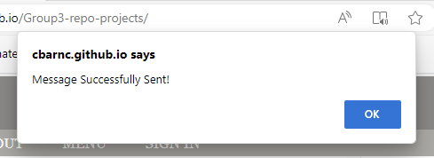
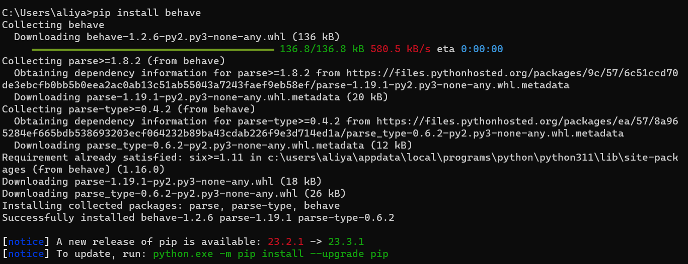
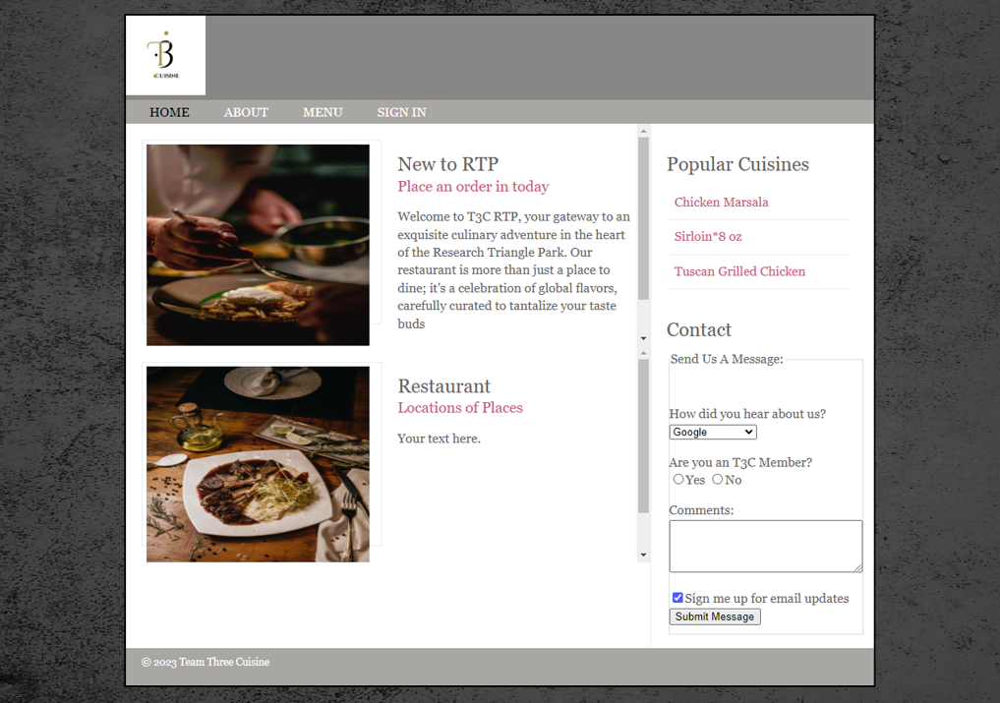
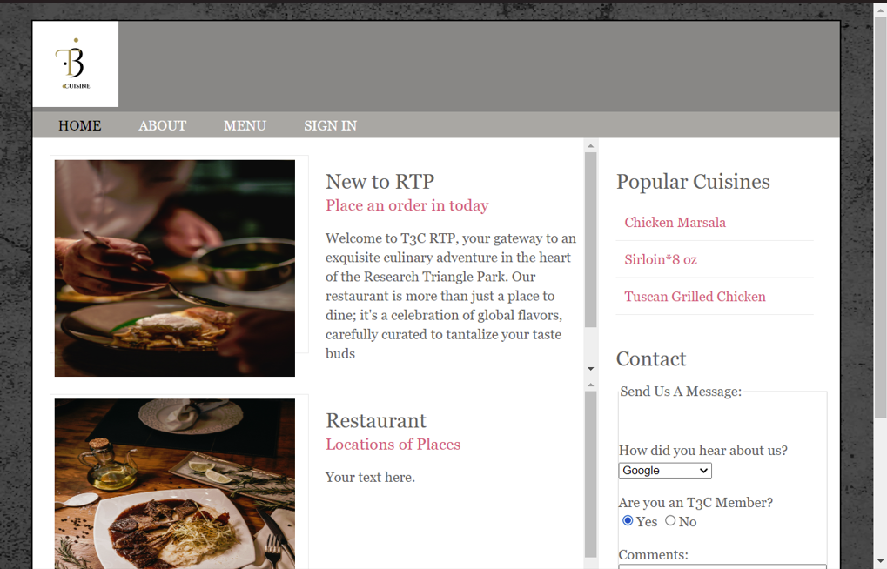
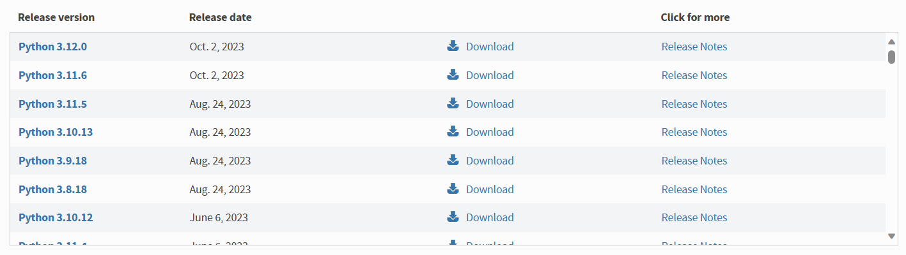

_______________________________________________________________________

	Group 3	SELENIUM LAB	
_______________________________________________________________________

## LAB 01	AUTOMATION WITH SELENIUM

### OBJECTIVES
- Automate browser actions for web application testing.
- Understand and utilize Selenium WebDriver using Python.
- Validate web application UI elements and functionalities.
- Create a Selenium Script
- Provide details on commands commonly used in Selenium

### PREREQUISITES
- Must have basic knowledge of software testing
- Must have knowledge on how to use locators
- Must have a basic level of knowledge of the python language

## BEFORE YOU GET STARTED
You will need the following in order for your tests to perform correctly 

- Install a web browser to run the web application
    - This can be:
        - Firefox (Recommended)
        - Chrome
        - Microsoft Edge
- Create a GitHub account
    - Clone the GitHub repository

### HOW TO CREATE A GITHUB ACCOUNT
- Navigate to this page on how to create a GitHub account: https://docs.github.com/en/get-started/onboarding/getting-started-with-your-github-account

### HOW TO CLONE A GITHUB REPOSITORY
- Navigate to this page on how to clone a GitHub repository: https://docs.github.com/en/repositories/creating-and-managing-repositories/cloning-a-repository
### OVERVIEW
Selenium is a great way to automate web interactions and perform automated browser testing. You can use selenium with multiple languages, but in this lab we will only focus on python. The latest version of selenium is selenium 4. The information below is a step-by-step guide on how to help you get started.

### Step 1: Install Python
If you have not, you will need to install Python on your computer. To do so please navigate to Python official website to download the latest version: https://www.python.org/downloads/ 

Note: Make sure to download the right file based on your OS, as well as adding Python to your system's PATH during installation.

The current supported versions for Selenium are:
- 2.7
- 3.5+

#### (IF YOU AlREADY HAVE PIP ON YOUR SYSTEM):
If you already have pip installed on our system, you can upgrade it by using the following command in either the command line or terminal:

### Step 2: Install Selenium
You can install Selenium using Python's package manager, pip. Open your command prompt or terminal and run the following command:    
`pip install selenium`

Once installed, a successfully installed message should be displayed.

- For more information on selenium, visit their website at: https://www.selenium.dev/

Note: If you find that you have problems installing selenium on your computer, please navigate to the [FAQ](#faq) section of this documented (located at the bottom)

### Step 3: Download a Web Driver
Selenium interacts with web browsers using drivers. You will need to download the appropriate driver for the web browser you want to automate. Such as Chrome, Firefox, and Edge.  
Drivers can be found in the following URL's:	

	- ChromeDriver: https://sites.google.com/a/chromium.org/chromedriver/	
	- GeckoDriver (for Firefox): https://github.com/mozilla/geckodriver/releases	
	- EdgeDriver: https://developer.microsoft.com/en-us/microsoft-edge/tools/webdriver/	
 
Note: Download the appropriate driver for your browser and make sure to add the driver exe to your system's PATH.  
For more platform options please visit the selenium official website, and scroll down to browsers.
(https://www.selenium.dev/downloads/)

Once Selenium is installed, you’re ready to create your first Selenium script!
### Step 4: Create Your First Selenium Script 
Here is a simple Python script that opens a browser, navigates to a website and performs some action with expected results:

Note: If you wish to use a different web browser, just change the name.

Example:
- .Chrome()
- .Edge()
- .Firefox()

## Step 5 (Do It Yourself) - Basic Selenium Commands

<!-- Click a button -->
### Click A Button
We will begin by first clicking a button. Below is a command that can help with this:

	button = driver.button = driver.find_element(By.CLASS_NAME, "my-button-class")	
	button.click()

1. Run the script
2. Fill out the message form
3. Click the "Submit Message" button for a surprise!

In the event you need to find the class name of the button:
- Go to the index.html file
- Scroll down to where you see the <button></button> tags
- The class name should be in the "class" section in between the quotation marks

<!-- Locate Elements -->
### Locate Elements on a Web Application

<!-- Interact with Elements -->

<!-- Interact with Elements -->

<!-- Fill out a Form -->

<!-- Submit a Form -->

<!-- Handling Dropdowns -->

<!-- Close and Quit the Web Driver -->

### Class Diagram of Web Application's Back-End Functionalities:

### FAQ (Frequently Asked Questions)
 
#### Question 1 : My command line is displaying this error message:

#### This error message is most likely due to:
- Your environment not having the correct path to your python folder/scripts.
- Your pip version not being in your "scripts" folder.
- Your python is outdated.
#### How do I fix this?:
### Method 1 (Copy the path into your environment)
- First type in `python` into your windows search bar (there should be a version of python already installed onto your computer)

- Right-click the version displayed and select `open file location` or click it on the right side of the panel

- Right-click on your python version once more and select `open file location`

##### Method 2 (Re-install)
- Navigate to the python website: https://www.python.org/downloads/

- Download and install one of the following python versions:

- Once everything has installed, try to enter the following pip command in either the command line or terminal.
`pip install selenium`

