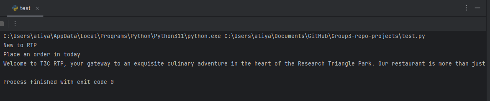
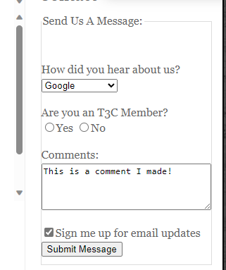
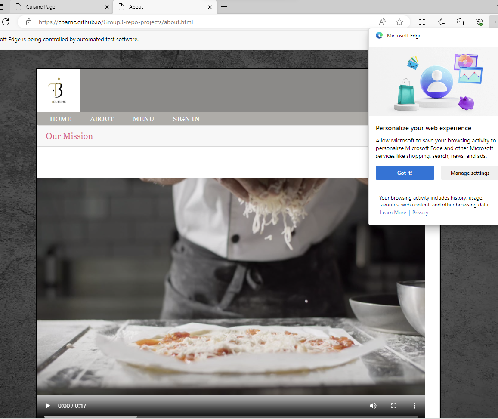

_______________________________________________________________________

	Group 3	SELENIUM LAB	
_______________________________________________________________________


## LAB 01	AUTOMATION WITH SELENIUM

### OBJECTIVES
- Automate browser actions for web application testing.
- Understand and utilize Selenium WebDriver using Python.
- Validate web application UI elements and functionalities.
- Create a Selenium Script
- Provide details on commands commonly used in Selenium

### PREREQUISITES
- Must have basic knowledge of software testing
- Must have knowledge on how to use locators
- Must have a basic level of knowledge of the python programming language
- Must have a basic level of knowledge of html

## BEFORE YOU GET STARTED
You will need the following in order for your tests to perform correctly 

- Install a web browser to run the web application
    - This can be:
        - Firefox (Recommended)
        - Chrome
        - Microsoft Edge
- Create a GitHub account
    - Clone the GitHub repository

### HOW TO CREATE A GITHUB ACCOUNT
- Navigate to this page on how to create a GitHub account: https://docs.github.com/en/get-started/onboarding/getting-started-with-your-github-account

### HOW TO CLONE A GITHUB REPOSITORY
- Navigate to this page on how to clone a GitHub repository: https://docs.github.com/en/repositories/creating-and-managing-repositories/cloning-a-repository
### OVERVIEW
Selenium is a great way to automate web interactions and perform automated browser testing. You can use selenium with multiple languages, but in this lab we will only focus on python. The latest version of selenium is selenium 4. The information below is a step-by-step guide on how to help you get started.

### Step 1: Install Python
If you have not already, you will need to install Python on your computer. To do so please navigate to Python official website to download the latest version: https://www.python.org/downloads/ 

**Note:** Make sure to download the right file based on your OS, as well as adding Python to your system's PATH during installation.

The current supported versions for Selenium are:
- 3.5+

#### (IF YOU AlREADY HAVE PIP ON YOUR SYSTEM):
If you already have pip installed on your system, you can upgrade it by using the following command in either the command line or terminal:

`pip install -U selenium`

### Step 2: Install Selenium
You can install Selenium using Python's package manager, pip. Open your command prompt or terminal and run the following command:   

`pip install selenium`


Once installed, a "Successfully installed" message should be displayed.

- For more information on selenium, visit their website at: https://www.selenium.dev/

**Note:** If you find that you have problems installing selenium on your computer, please navigate to the [FAQ](#faq) section of this document

### Step 3: Download a Web Driver
Selenium interacts with web browsers using drivers. You will need to download the appropriate driver for the web browser you want to automate. Such as Chrome, Firefox, and Edge.  
Drivers can be found in the following URL's:	

	- ChromeDriver: https://sites.google.com/a/chromium.org/chromedriver/	
	- GeckoDriver (for Firefox): https://github.com/mozilla/geckodriver/releases	
	- EdgeDriver: https://developer.microsoft.com/en-us/microsoft-edge/tools/webdriver/	
 
**Note:** Download the appropriate driver for your browser and make sure to add the driver exe to your system's PATH.  
For more platform options please visit the selenium official website, and scroll down to browsers.
(https://www.selenium.dev/downloads/)


Once Selenium is installed, you’re ready to create your first Selenium script!
### Step 4: Creating Your First Selenium Script 
Here is a simple Python script that opens a browser, navigates to a website, and performs some action with expected results:

If you wish to use a different web browser, just change the name.

**Examples Include:**
.Chrome()
.Edge()
.Firefox()


## Step 5: (Do It Yourself) - Basic Selenium Commands
 <a id="website"></a>
Website used for these demonstrations: https://cbarnc.github.io/Group3-repo-projects/
<!-- Click a button -->
### COMMAND 1 - Clicking A Button
We will begin by first clicking a button. Below is the command that can help with this:

	driver.find_element(By.XPATH, "/html/body/div/aside/section[2]/form/fieldset/button").click()

- This line of code uses Selenium to locate an HTML element on a web page using an XPath expression as the locator. 
- It locates the HTML element specified by the provided XPath.
- `.click()`: After the element is located using the XPath expression, the `.click()` method is called on that element.
- This method instructs Selenium to simulate a click action on the located HTML element.

Here is the full code provided in order for you to run it:

```python
from selenium import webdriver
from selenium.webdriver.common.by import By

options = webdriver.EdgeOptions()
options.add_experimental_option("detach", True)  # Keeps the webpage from automatically closing
driver = webdriver.Edge(options=options)
driver.get("https://cbarnc.github.io/Group3-repo-projects/") # Gets the website

# Maximizing window
driver.maximize_window()

# Click a button
driver.find_element(By.XPATH, "/html/body/div/aside/section[2]/form/fieldset/button").click()

```

1. Run the script
2. See the surprise message that pops up!


In the event you need to find the XPATH of the button:
- Go to our website [(listed above)](#website)
- Right-click on the website button and choose inspection
- Right-click again on the <button></button> section and go to: Copy -> Copy Full XPATH

<!-- Locate Elements -->
### COMMAND 2 - Locate Elements on a Web Application
We will be finding the following elements on our website:
- h2 (heading 2)
- h3 (heading 3)
- p (paragraph)

Below are the commands that can help with this:

    h2 = driver.find_element(By.TAG_NAME, "h2")
    print(h2.text)

    h3 = driver.find_element(By.TAG_NAME, "h3")
    print(h3.text)

    p = driver.find_element(By.TAG_NAME, "p")
    print(p.text)

- These commands use Selenium to locate an HTML element based on its tag name. 
- After the elements are located and stored in the variables, they are then printed using the `print()` statement

Here is the full code provided in order for you to run it:

```python
from selenium import webdriver
from selenium.webdriver.common.by import By

options = webdriver.EdgeOptions()
options.add_experimental_option("detach", True)  # Keeps the webpage from automatically closing
driver = webdriver.Edge(options=options)
driver.get("https://cbarnc.github.io/Group3-repo-projects/") # Gets the website

# Maximizing window
driver.maximize_window()

# Find element by tag name
h2 = driver.find_element(By.TAG_NAME, "h2")
print(h2.text)

h3 = driver.find_element(By.TAG_NAME, "h3")
print(h3.text)

p = driver.find_element(By.TAG_NAME, "p")
print(p.text)

```

1. Run the script
2. Look at the compiler to see the headings and paragraph text



In the event you need to find the tag name:
- Go to our website [(listed above)](#website)
- Right-click on the heading or paragraph you want to find the tag for and choose inspection

<!-- Testing Comment Text Area -->
### COMMAND 3 - Testing Comment Text Area
Below is the command that can help with this:

    comments = driver.find_element(By.ID, "comments")
    comments.send_keys("This is a comment I made!")

- This first line uses Selenium to locate an HTML element by its ID attribute. 
- After the element with the ID "comments" is located and stored in the `comments` variable, this line of code simulates keyboard input by sending the text "This is a comment I made!" to the HTML input element with that ID.

Here is the full code provided in order for you to run it:

```python
from selenium import webdriver
from selenium.webdriver.common.by import By

options = webdriver.EdgeOptions()
options.add_experimental_option("detach", True)  # Keeps the webpage from automatically closing
driver = webdriver.Edge(options=options)
driver.get("https://cbarnc.github.io/Group3-repo-projects/") # Gets the website

# Maximizing window
driver.maximize_window()

# Testing comments
comments = driver.find_element(By.ID, "comments")
comments.send_keys("This is a comment I made!")

```

1. Run the script
2. Look at the comment text box area to see your message!



In the event you need to find the id of the comment section:
- Go to our website [(listed above)](#website)
- Right-click on the comment text area and choose inspection
- You should be able to see the id in the <textarea> tags

<!-- Close and Quit the Web Driver -->
### COMMAND 4 - Close the Web Driver Tab
Below are the commands that can help with this:
    
    driver.execute_script("window.open('https://cbarnc.github.io/Group3-repo-projects/about.html', '_blank');")
    driver.switch_to.window(driver.window_handles[1])
    time.sleep(5)
    driver.close()

    driver.switch_to.window(driver.window_handles[0])


    # time before window closes
    time.sleep(2)


    # Close Edge browser
    driver.quit()

- This first command uses `execute_script` in Selenium to open a new browser tab or window with the URL 'https://cbarnc.github.io/Group3-repo-projects/about.html' using the JavaScript `window.open` method.
- The second argument '_blank' specifies that the URL should open in a new tab or window.
- The `driver.window_handles[1]` accesses the handle of the second window (tab).
- The `time.sleep(5)` delays the browser from closing for 5 seconds
- After the 5 seconds the `driver.close()` command closes the new opened tab
- The `driver.switch_to.window` command switches the focus of the WebDriver back to the first tab. It uses `driver.window_handles[0]` to access the handle of the first tab.
- The `time.sleep(2)` delays the browser from closing for 2 seconds
- After the 2 seconds the `driver.quit()` command closes the browser

Here is the full code provided in order for you to run it:

```python
from selenium import webdriver
from selenium.webdriver.common.by import By
import time

options = webdriver.EdgeOptions()
options.add_experimental_option("detach", True)  # Keeps the webpage from automatically closing
driver = webdriver.Edge(options=options)
driver.get("https://cbarnc.github.io/Group3-repo-projects/") # Gets the website

# Get the url of the new tab
driver.execute_script("window.open('https://cbarnc.github.io/Group3-repo-projects/about.html', '_blank');")

# Switch to a new tab
driver.switch_to.window(driver.window_handles[1])

# Time before tab closes
time.sleep(5)

# Close tab
driver.close()

# Switch back to original url
driver.switch_to.window(driver.window_handles[0])


# Time before browser closes
time.sleep(2)


# Close Edge browser
driver.quit()


```

1. Run the script
2. See the browser open into a new tab and close afterwards!



### COMMAND 5 - Close the Web Driver Browser
This is an easier command and can be done below:
    
    driver.quit()

- This command is used in Selenium to close the web browser and terminate the WebDriver session.

Here is the full code provided in order for you to run it:

```python
from selenium import webdriver
from selenium.webdriver.common.by import By
import time

options = webdriver.EdgeOptions()
options.add_experimental_option("detach", True)  # Keeps the webpage from automatically closing
driver = webdriver.Edge(options=options)
driver.get("https://cbarnc.github.io/Group3-repo-projects/") # Gets the website

# Maximizing window
driver.maximize_window()

# Time before window closes
time.sleep(2)

# Close Edge browser
driver.quit()

```

1. Run the script
2. Wait 2 seconds for your browser to close

## FAQ (Frequently Asked Questions)
 <a id="faq"></a>
#### Question 1 : My command line is displaying this error message:


#### This error message is most likely due to:
- Your environment not having the correct path to your python folder/scripts.
- Your pip version not being in your "scripts" folder.
- Your python is outdated.
#### How do I fix this?:
#### Method 1 (Copy the path into your environment)
- First type in `python` into your windows search bar (there should be a version of python already installed onto your computer)


- Right-click the version displayed and select `open file location` or click it on the right side of the panel


- Right-click on your python version once more and select `open file location`

#### Method 2 (Re-install)
- Navigate to the python website: https://www.python.org/downloads/

- Download and install one of the following python versions:


- Once everything has installed, try to enter the following pip command in either the command line or terminal.
`pip install selenium`


